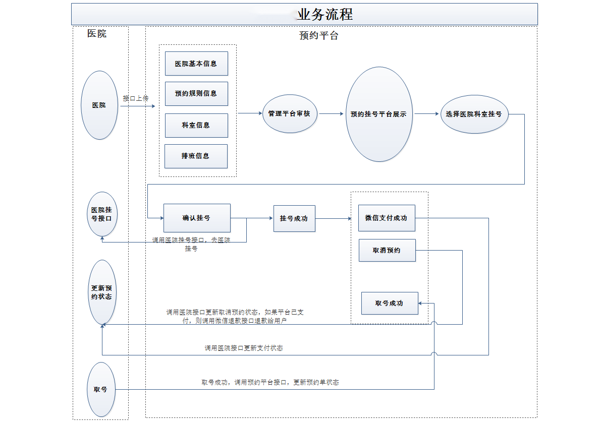
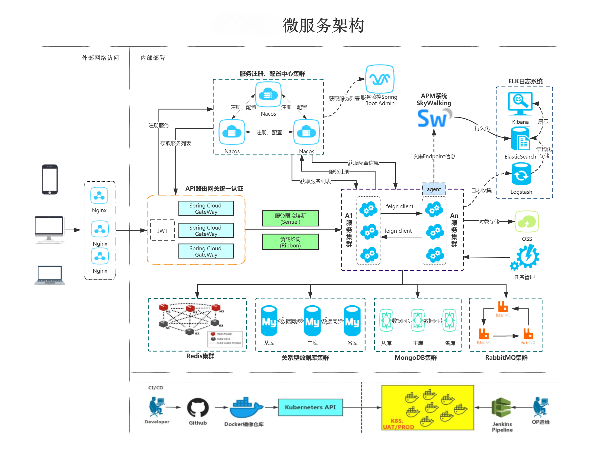

# Medical-Information-Platform


## 1.背景介绍:
这是一个预约挂号平台，**用户** 可以通过平台查看医院的信息，医生的信息，科室的信息，以及预约挂号的信息。**医院管理员**可以通过平台查看所有的信息，以及对信息进行增删改查的操作。**平台管理员** 可以对医院的信息进行增删改查的操作。

## 2.核心技术
SpringBoot2：简化新 Spring 应用的初始搭建以及开发过程

SpringCloud：SpringCloudGateway、Spring Cloud Alibaba Nacos

MyBatis-Plus：持久层框架

Mysql：关系型数据库

Redis：内存缓存

MongoDB：面向文档的 NoSQL 数据库

RabbitMQ：消息中间件

HTTPClient: Http 协议客户端

Swagger2：Api 接口文档工具

Nginx：负载均衡


---------------------------------------
[Admin](https://github.com/LuyuZhang00/MIP-Vue-Admin)

vue-admin-template：后台管理系统模板

Element UI：基于 Vue的桌面端组件库

axios：基于 promise 的 HTTP 库

iconfont ：阿里巴巴矢量图标库

**主要功能：**
```
数据管理
	数据字典（字典树形展示、导入、导出）
医药管理
	医院设置（列表、添加、修改、删除）
	医药列表（列表、详情、排班、下线）
会员管理
	会员列表（列表、查看、锁定）
	认证审批列表
订单管理
	订单列表（列表、详情）
统计管理
	预约统计
```
---------------------------------------
[前端](https://github.com/LuyuZhang00/MIP-Nuxt-FrontEnd)

Nuxt：服务端渲染框架

Node.js： JavaScript 运行环境

Axios：Axios 是一个基于 promise 的 HTTP 库

**主要功能：**
```
首页数据展示
	医院列表
医院详情展示
	医院科室展示
用户登录功能
	手机号登录（短信验证码发送）
	微信登录
用户实名认证
就诊人管理
	列表、添加、详情、删除	
预约挂号功能
	排版和挂号详情信息
	确认挂号信息
	生成预约挂号订单
	挂号订单支付（微信）
	取消预约订单
就医提醒功能
```

---------------------------------------


## 3.业务流程



## 4.服务架构


## 5.模块说明
后端模块：
```
common：公共模块父节点
		common-util：工具类模块，所有模块都可以依赖于它
		rabbit-util：rabbitmq业务封装
		service-util：service服务的工具包，包含service服务的公共配置类，所有service模块依赖于它
hospital-manage：医院接口模拟端
model：实体类模块
server-gateway：服务网关
service：api接口服务父节点
    service-cmn：字典api接口服务
    service-hosp：医院api接口服务
    service-order：订单api接口服务
    service-oss：文件存储api接口服务
    service-sms：短信api接口服务
    service-statistics：统计api接口服务
    service-task：定时任务服务
    service-user：用户api接口服务
service-client：feign服务调用父节点
    service-cmn-client：字典api接口
    service-hosp-client：医院api接口
    service-order-client：订单api接口
    service-user-client：用户api接口
```

Admin模块：
```
bulid：构建相关
config：全局配置
src：源代码
    api：所有请求
    assets：主题 字体等静态资源
    components：全局公共组件
    icons：项目所有svg icons
    router：路由
    store：全局store管理
    styles：全局样式
    utils：全局公用方法
    views：视图	
    App.vue：入口页面
    main.js：入口 加载组件 初始化等
    permission.js：权限管理
static：静态资源
.babelrc：babel-loader配置
.eslintrc.js：eslint配置项
.gitignore：git忽略项
package.json：依赖管理
```

前端模块：
```
assets：资源目录
components：组件目录
layouts：布局页面
pages：页面目录
plugins：插件目录
nuxt.config.js：nuxt.js应用的个性化配置
```

## 遇到的问题

1.包版本冲突问题解决： 通过```Dependency Analyzer```插件查看依赖关系，红色的是使用的，exclude其他的，记得然后maven刷新后才生效。

1.医院模拟接口启动异常：

（1）循环依赖：

根本方法是重构代码，将循环依赖的部分抽离出来，形成一个新的类，然后在原来的类中引用新的类。```apiController```和```apiServiceImpl```解耦。

也可以在```application.yml```添加：
```
spring:
    main:
        allow-circular-references: true
```

（2）空指针异常，在```application.yml```添加
```
spring:
    mvc:
        pathmatch:
          matching-strategy: ant_path_matcher
```

3.
Nacos启动异常：
（1）查询端口是否开放，是否有其他程序占用。windows下cmd输入```netstat -ano | findstr :8848```查看端口占用情况。
（2）使用  console网址登录 
（3）注意springboot版本，nacos版本，cloud版本的兼容性问题。


注：
来源：尚硅谷项目实战 [尚医通](https://www.bilibili.com/video/BV1V5411K7rT)   [在线答疑文档](https://docs.qq.com/doc/DT2JPQUVvb015RHVB)


