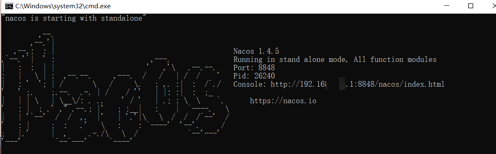

# Medical-Information-Platform


从0开始写一个医疗信息平台的前后端项目
## 遇到的问题

1.包版本冲突问题解决： 通过```Dependency Analyzer```插件查看依赖关系，红色的是使用的，exclude其他的，记得然后maven刷新后才生效。

1.医院模拟接口启动异常：

（1）循环依赖：

根本方法是重构代码，将循环依赖的部分抽离出来，形成一个新的类，然后在原来的类中引用新的类。```apiController```和```apiServiceImpl```解耦。

也可以在```application.yml```添加：
```
spring:
    main:
        allow-circular-references: true
```

（2）空指针异常，在```application.yml```添加
```
spring:
    mvc:
        pathmatch:
          matching-strategy: ant_path_matcher
```

3.
Nacos启动异常：
（1）查询端口是否开放，是否有其他程序占用。windows下cmd输入```netstat -ano | findstr :8848```查看端口占用情况。
（2）使用  console网址登录 
（3）注意springboot版本，nacos版本，cloud版本的兼容性问题。

